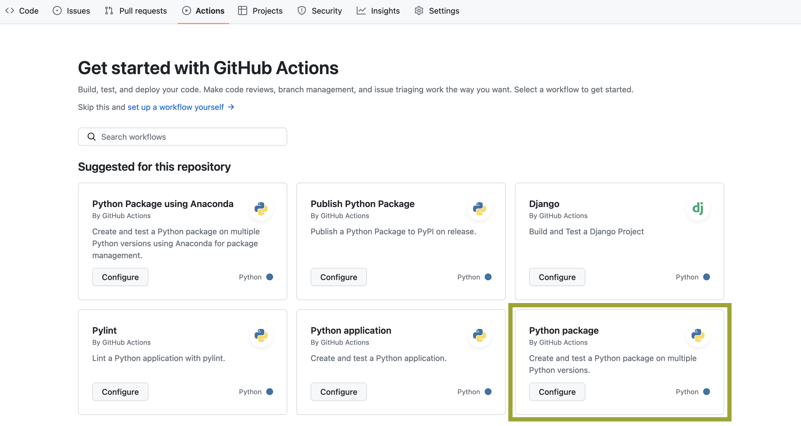
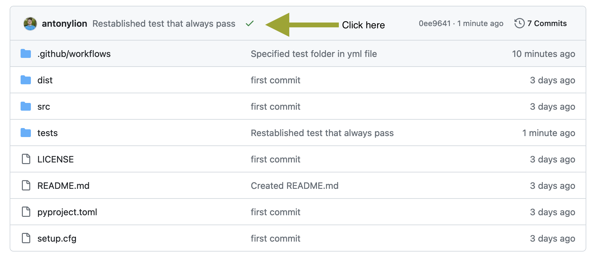
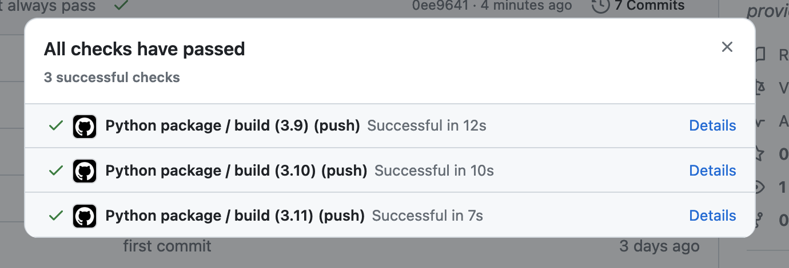
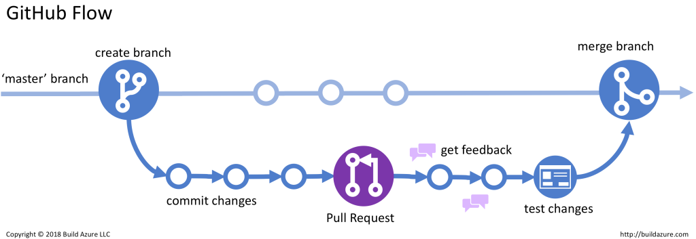
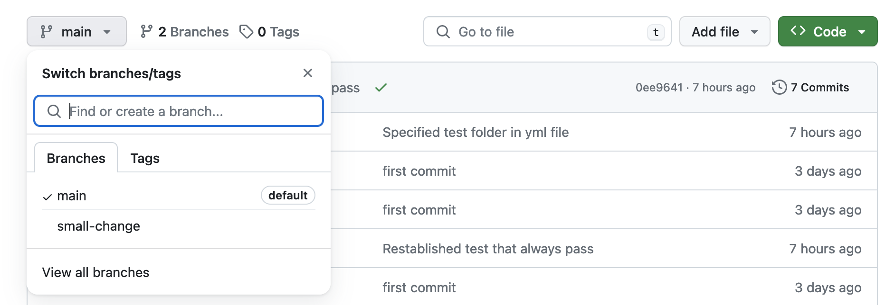
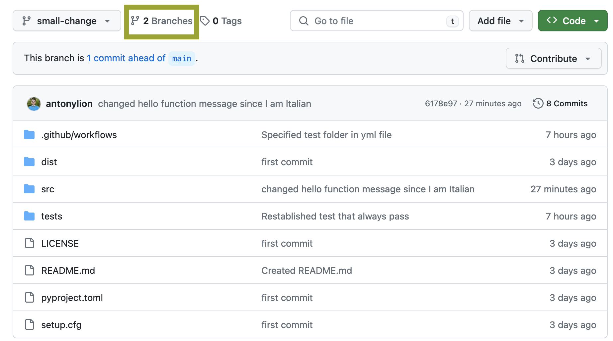
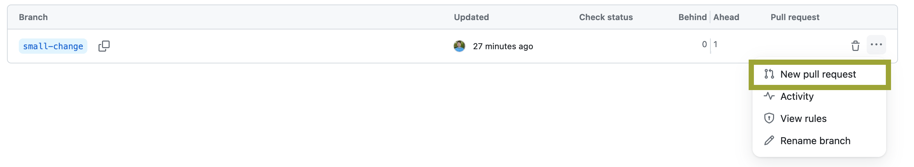
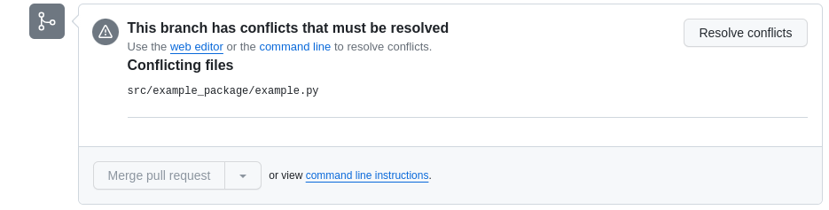
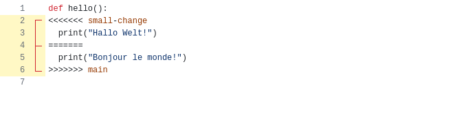
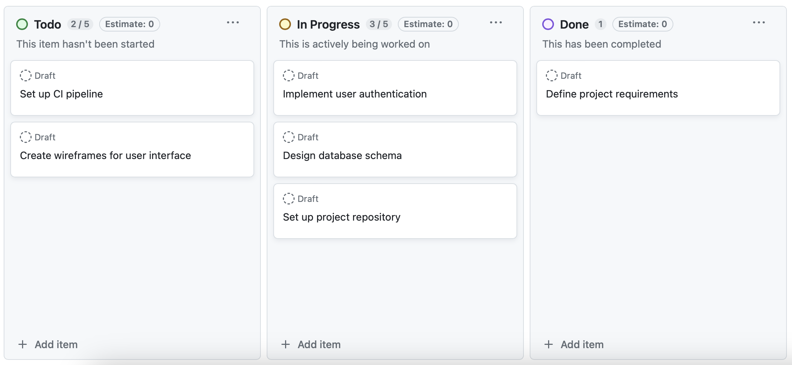

# Software development in MF-DAS

With this tutorial we want to guide you through a tested and functional way of starting your new Python project in MF-DAS. This will hopefully help you and others in understanding, modifying and deploying your project.

## Agenda
- Learn how to create, build and install a Python package
- Learn about the GitHub Flow
- Test Driven Development and testing with pytest
- Documenting code
- Publishing a Python package
- Static code analysis tools
- Design by Contract using Deal

Every lesson also include elements of CI/CD since we are going to **automate** all the steps.

## Create, build and install a Python package
This is the the structure we conceive the modern one for a Python project inside MF-DAS

```
├── your_project
│   ├── LICENSE (empty)
│   ├── pyproject.toml
│   ├── setup.cfg (empty)
│   ├── README.md (empty)
│   ├── src/
│   │   ├── example_package/
│   │   │   ├── __init__.py (empty)
│   │   │   ├── example.py
│   ├── tests/
│   │   ├── test_main.py (empty)
```

To start, create these directories and empty files. Tip: if you're working from linux-like terminal, you can create a new empty file with:

```
touch new_file.extension
```

Let's then populate the project configuration file *pyproject.toml*. We will set it to initially install numpy and pandas:

```
[project]
name = "hello-world"
version = "1.0.0"
description "My first Python package"
requires-python = ">=3.8"
authors = [
  {name = "John Doe", email = "john@example.com"},
]
dependencies = [
  "numpy",
  "pandas"
]
```

If your project is structured as above, then build it with:

```
python3 -m pip install --upgrade build
python3 -m build
```

This last command builds the binary distribution package of your project, called wheel. Wheels are a packaging standard that allows for faster installations and a more efficient distribution process of your software.

So we are now ready to install the wheel with pip install:

```
pip install dist/hello_world-1.0.0-py3-none-any.whl
```

Great, you created your package! Let's now create the package version 1.0.1, which acctually contain some code to run :)

Let's put an hello world function inside src/example_package/example.py:

```
def hello():
	print("Hello world!")
```

Now let's update the version of our package in the pyproject.toml file:

```
...
version = "1.0.1"
...
```

Build the new package

```
python3 -m build
```

And install it (the old version is automatically disinstalled):

```
pip install dist/hello_world-1.0.1-py3-none-any.whl
```

Great! Let's now test our package. Open the python3 console:

```
python3
```

Import our module and run the hello function:

```
>>> from example_package import example
>>> example.hello()
Hello world!
```

## The GitHub Flow

Version control enables collaborative development because it:
- Tracks who made changes in the code and what they are
- Allows you to revert back to a previous version of the code
- Allows parallel versions of the software to be developed at the same time and then merged to a single version later

**Git** seems to have eliminated all other version control systems and is pretty much the only game in town. Some terminology:

- *repository*: source code along with the full change history
- *clone*: your own copy of the repository
- *fork*: a copy of the repository that is being independently maintained
- *branch*: a divergent change history that is maintained in parallel with other branches
- *commit*: a smallest unit of change in the source code
- *merge*: incorporate changes from one branch into another one
- *conflict*: occurs when two branches have changes to the same file
- *pull (merge) request*: a request to incorporate changes from a branch to the main branch of the project
- *check out*: update to your local copy of the repository
- *rebase*: incorporate changes made in the main branch to your branch

### Initialize Your GitHub Repository

GitHub is a cloud-based platform that provides hosting for Git repositories, enabling version control, collaborative software development and project management, through their servers. 
To store our Git repository on GitHub we first need to setup authentification correctly. Right now easiest seems to be through the [use of an SSH key](https://docs.github.com/en/authentication/connecting-to-github-with-ssh/generating-a-new-ssh-key-and-adding-it-to-the-ssh-agent).

After setting up authentification, create a [new *empty* repository on GitHub](https://github.com/new). Do NOT add any file (e.g. README, .gitignore, etc.) from the web platform.

Now, from the root folder of your project:

```
git init -b main
git add .
git commit -m "first commit"
git remote add origin git@github.com:/yourusername/name-of-your-github-repo.git
git push -u origin main
```

Congratulations, you just pushed on GitHub your Python package. To finish this section, let's just add a small modification to the package and push the changes to GitHub. We will simply create a README.md file for our package:

```
echo "# Hello World package" > README.md
```

Then:

```
git add README.md
git commit -am "Created README.md"
git push
```

### Setting Up CI/CD for Your GitHub Repository

CI/CD stands for Continous Integration/Continous Deployment. CI/CD involves the automated testing, building, and deployment processes integrated directly into a GitHub repository. When a developer makes changes to the Python package's code, GitHub CI/CD automatically triggers a series of actions, including running tests to ensure the code's integrity and functionality. If the tests pass, the CI/CD pipeline proceeds to build the package and, in a Continuous Deployment setup, deploys it to a specified environment. This automated workflow helps catch errors early in development, ensures consistent code quality, and facilitates efficient and reliable delivery of updates to users. For Python packages, GitHub CI/CD is crucial as it streamlines the development lifecycle, reduces manual intervention, and enables swift and reliable delivery of improvements or new features to end-users.

In order to set up CI/CD for our package, let move to our repository webpage on GitHub. Then click "Actions" in the repo header. So *Configure* Python package:



This will create a new directory called .github/workflows in which you will put your CI/CD scripts in YAML format. By default, GitHub is creating *python-package.yml*. Edit this file such that the last line states the following instruction:
```
pytest tests/
```
We basically said to pytest that everytime we will push code to our repository, all the test contained in the *tests* folder must be completed in order to build the Python package. So, after this modification, just commit this new file via GitHub web by clicking "Commit changes...".

At this point, pull this new commit on your local copy of the repo:

```
git pull
```

Now open the file *tests/test_main.py* and let's define a first test that always pass :)

```
def test_main():
	assert(True)
```

Commit and push this modification to your GitHub repo in the usual way, and investigate the execution log:






### Key components of the GitHub Flow

In the following you can find a representation of the tipycal GitHub flow associated with changes being made to a software repository.



1. *Master Branch:* The main branch, often named "master," represents the stable version of the project.

2. *Create a New Branch:* Developers create a new branch when working on a feature or fixing a bug. This keeps changes isolated from the main branch until they're ready.

3. *Commit Changes:* Developers make changes in the new branch, committing snapshots along the way.

4. *Pull Request:* Developers open a pull request to propose their changes. This allows team members to review the code and discuss potential modifications.

5. *Get Feedback:* Team members provide feedback on the proposed changes through discussions within the pull request. This collaborative process ensures the quality and correctness of the code.

6. *Test Changes:* Developers, including automated testing tools like pytest, thoroughly test the changes to verify functionality and prevent unintended side effects.

7. *Merge Branch:* If everything works as intended and the changes are approved, the branch is merged into the master branch. This process helps maintain a clean and stable main branch while allowing for parallel development.

Let's follow the GitHub flow for making changes to our repository :)
Open a terminal from the project root your repo create a new branch:

```
git checkout -b branch-name
```

The -b option **creates** a new branch and switches to it. In general, to switch to an existing branch:

```
git checkout branch-name
```

Now introduce some change to your project, but pay attention: commits should be relatively small. After each commit your software should still work. Multiple file commits are generally discouraged and a single commit should be able to fit in your own memory. In this example, we will just change the message printed by the hello() function in *src/example_package/example.py*:

```
def hello():
	print("Ciao mondo!")
```

To look at what changed in your local copy of the repo, you can always type:

```
git status
```

Now we are ready to commit our change. From the project root:

```
git add src/example_package/example.py
git commit -m 'changed hello function message for Italian speakers'
```

As a rule, commit messages should describe what was changed, where and why.
When pushing your branch for the first time:

```
git push --set-upstream origin branch-name
```

After that you can check which branch you are in with:


```
git branch
```

And push changes with:

```
git push
```

**Exercise**: add a new function called *fibonacci* to *src/example_package/example.py*. This takes as input an integer N, such that N > 3, and return a list with the first N numbers belonging to the [Fibonacci series](https://en.wikipedia.org/wiki/Fibonacci_sequence). After defining the function, add at least 2 tests in *tests/test_main.py* which actually assert the behaviour of the *fibonacci* function. You can learn more on how to write tests in the [Official pytest documentation](https://docs.pytest.org/en/8.0.x/).

When you're done, push all these changes to your branch. Finally, check from the GitHub web interface whether your code built successfully :)

For instace, you can look at the state of other branches from the web interface switching branches like here:



It's now time to make a **pull request**. This is actually a request to merge your branch into the main project branch. While there seems to be a way to do it from the command line most people probably use a corresponding function from the web interface of GitHub. Click on *branches*:



Thus click on "*...*" and select *New pull request*:





Other project members can review and comment on your pull requests. Reviewers can be assigned whose clearance must be obtained before the pull request can be merged. If changes are requested then those requests can be addressed by simply making changes to the branch in question and pushing them to the remote repository from which the pull request was made.

Once everyone is happy, changes can be merged.

When opening a pull request, conflicts may arise: these appear when the same files have been changed in the main branch and in the branch of the pull request:




In this case, conflicts need to be resolved by hand:



In this exemplar case in the above image, you should keep only one version of the *hello* function, e.g.:

```
def hello():
	print("Hallo Welt!")
```

All other lines in the function must be deleted.

## Documenting your code

Docstrings are the standard way to document your code in Python: they are multi-line strings that follow the method or class header. They explain the method, its arguments and help users of your package understand what it does and how to call it. There are standards for how to write them, and we recomment the Numpy one:

```
def add(a, b):
	"""The sum of two numbers.
	Parameters
	----------
	a: int
	   First argument to be added
	b: int
	   Second argument to be added

	Returns
	-------
	int
	   The sum of 'x' and 'y'
	"""
```

The tool we recommend for building documentaion is pdoc. You just have to:
```
mkdir doc
pdoc src/yourmodule -o doc
```

And also publishing the documentation is very easy. You can harness GitHub Actions to this purpose by simply copying [this file](https://github.com/mitmproxy/pdoc/blob/main/.github/workflows/docs.yml) to *.github/workflows/* and edit it based on the comments in that file. Your documentation will now be at *https://username.github.io/reponame/*.

As an exercise, you can:
- Add docstrings to your code
- Build documentation using pdoc and open it in your browser
- Add a GitHub action to automatically update and host documentation when a push is done to the repository or a pull request is merged

## Publishing Your Package on PyPi

This part will serve two purposes:
- Learning about the CD (Continous Delivery) in CI/CD
- Make your software publicly accessible

Packaging software is usually time consuming and error prone if done by hand, so we will learn how to do it automatically. The goal is to have a package be delivered automatically upon each release of your software. To this aim, we will use PyPi: it stands for Python Package Index and it is the repository used by the pip package manager.

First, create a [PyPi account](https://pypi.org/account/register/) and **setup two-factor authentication**. **You will need an authenticator app** (e.g. Google Authenticator, Microsoft Authenticator, privacyIDEAAuthenticator, etc.). After doing this, setup a [PyPi API token](https://pypi.org/manage/account/token/) for your account. With the token in hand, create or edit your $HOME/.pypirc file adding these lines:


```
[pypi]
username = __token__
password = <the token value, including the `pypi-` prefix>
```

For instance, you must leave ```__token__``` as username, while you have to put your API token in the password field.

Now make sure build and twine are installed:

```
pip install twine build
```

And you are **almost** ready to publish your package. The last step you need to take is to **rename** your project in the *pyproject.toml* file. Please enter a unique identifying name for your project otherwise you will get an error as you're trying to publish a package own by someone else who registered a package called like yours before (our initial *hello-world* will not work:)). After having done this, let's put our package on PyPi!

```
rm dist/*
python -m build
python -m twine upload dist/*
```

Great! You **and others** can now install your package with:

```
pip install your-package-name
```

As a last step, let GitHub Actions publish your package for you when a new release is available :) Edit the *run* part of *.github/workflows* like follows:


```
run: |
        pytest tests/
        twine upload dist/*
```

## Static Code Analysis

Static code analysis tools are used to enforce certain simple quality standards on your code. For example, they can check that the code is formatted according to a chosen coding style; some can also check for common simple bugs in your code. Other common usage is to calculate the test coverage of your code (which lines are covered by tests and which are not). 

**Linters** do some basic static checks of your code and are able to catch simple bugs and give warning (e.g. if a function is imported but not used). [Pylama](https://github.com/klen/pylama) is a project that encompasses many such tools. Install it with:

```
pip install pylama
```

And run it with

```
pylama src/
```

[Coveralls](https://coveralls.io/) is a service integrated with GitHub that gives you test coverage feedback. It also lets you display a badge on your GitHub repository showing your test coverage percentage (as a way to show people that you've taken this tutorial and know the value of testing). To add it to your GitHub repository, first [sign in](https://coveralls.io/sign-up) to Coveralls with your GitHub account. Then click on 'Add repos' and turn the coveralls switch on to your GitHub repository (the easiest is that this repo is public). Thus, click *start uploading coverage*. Install coveralls-python:

```
pip install coveralls
```

And launch the code coverage process:


```
coverage run --source=src/example_package src/example_package/example.py tests
```

Now copy your **COVERALLS_REPO_TOKEN** from the coveralls webpage regarding your repo and type:

```
COVERALLS_REPO_TOKEN=your_personal_token coveralls
```

At the end of the process you will get a link with the code coverage and the code to embed its badge on your repo's README file :)

## Design by Contract


```
def int_divide(a, b):
	assert(isinstance(a, int))
	assert(isinstance(b, int))
	assert(b != 0)
	return a / b
```

The use of **assert** to check method arguments is a rudimentary form of desgin by contract. And if used extensively it can greatly help you debug your code. Design by Contract (DbC) is an extension of the idea using *assert* to check correctness of programs. Programs designed using DbC use the following three checks:
- Precondition - needs to be satisfied before the method is executed
- Postcondition - needs to be satisfied after the method is exectued
- Invariant - needs to be satisfied at all times during the program execution

Design by contract helps bring some of the advantages of static langauges like C++/Haskell etc. to a dynamic language like Python.

We will be using [deal](https://deal.readthedocs.io/) which adds DbC functionality to Python:

```
pip install deal
```

You can now add preconditions with @deal.pre:

```
@deal.pre(lambda *args: all(arg > 0 for arg in args))
def sum_positive(*args):
	return sum(args)
```

```
sum_positive(1, 2, 3, 4)
# 10

sum_positive(1, 2, -3, 4)
# PreContractError: expected all(arg > 0 for arg in args) (where args=(1, 2, -3, 4))
```

Postconditions with @deal.post or @deal.ensure:

```
@deal.ensure(lambda x, result: x != result)
def double(x):
	return x * 2

double(2)
# 4
double(0)
# PostContractError: expected x != result (where result=0, x=0)
```

And invariant conditions with @deal.inv:

```
@deal.inv(lambda post: post.likes >= 0)
class Post:
	likes = 0

post = Post()

post.likes = 10

post.likes = -10

# InvContractError: expected post.likes >= 0

type(post)
# deal.core.PostInvarianted
```

## Basic Project Management with Kanban

Kanban is a method to visualize the state of the project popularized by Taiichi Ohno from Toyota. Tasks are symbolized by cards placed on a board. This cards contain a description of the task, who it is assigned to, its priority and deadline.
Tasks are place into columns on the board which can be customized. In software projects the most common columns are "To Do", "In Progress", and "Done". The cards are moved from left to right depending on their status. This allows for a quick overview of the state of the project. A board is usually created for a relatively self contained project; for example a new feature.

Kanban is a staple of many Agile methodologies.



You can setup a Kanban project in your GitHub repository via the Projects functionality. It is closely integrated with the rest of GitHub to reference Pull Requests and Issues from the Issue tracker.
