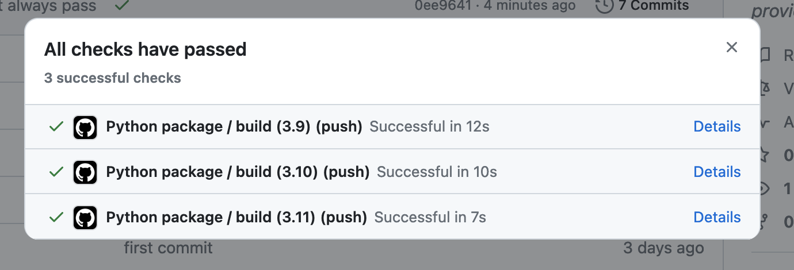
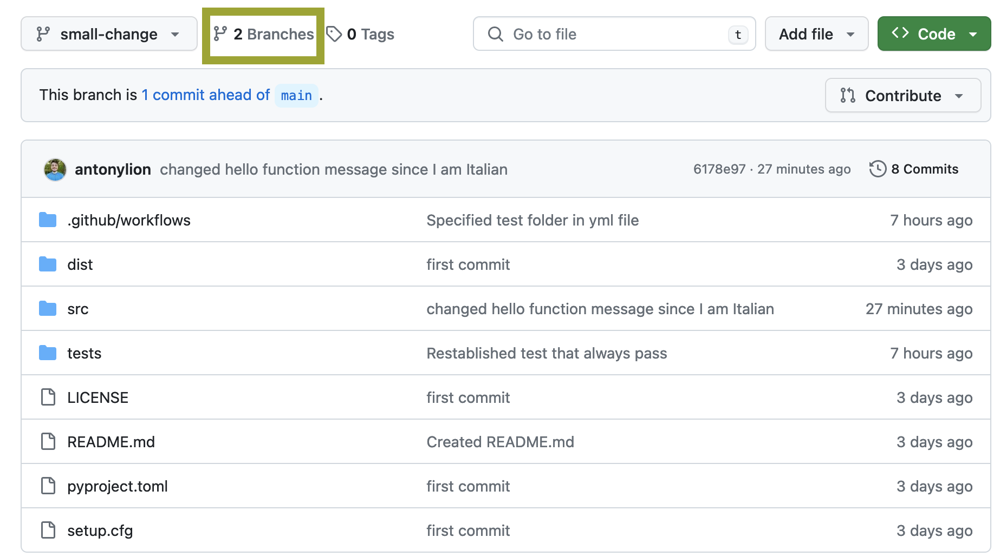
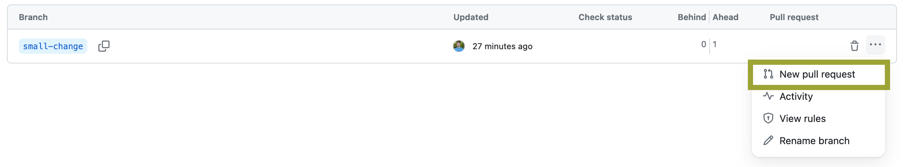
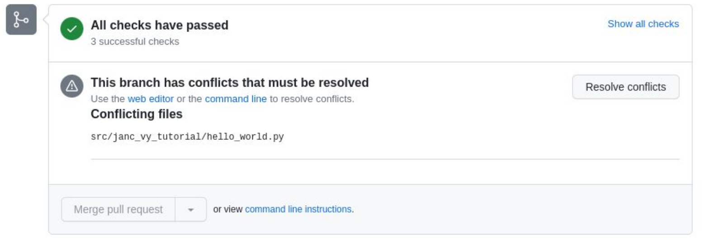
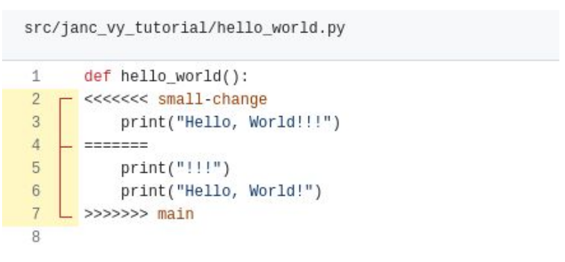

# Software development in MF-DAS

With this tutorial we want to guide you through a tested and functional way of starting your new Python project in MF-DAS. This will hopefully help you and others in understanding and modifying the software you created :)

## Agenda
- Learn how to create, build and install a Python package
- Learn about the GitHub Flow
- Test Driven Development and testing with pytest
- Documenting code
- Publishing a Python package
- Static code analysis tools
- Design by Contract using Deal
Every lesson also include elements of CI/CD since we are going to **automate** all the steps.

## Create, build and install a Python package
This is the the structure we conceive the modern one for a Python project inside MF-DAS

```
├── your_project
│   ├── LICENSE (empty)
│   ├── pyproject.toml
│   ├── setup.cfg (empty)
│   ├── README.md (empty)
│   ├── src/
│   │   ├── example_package/
│   │   │   ├── __init__.py (empty)
│   │   │   ├── example.py
│   ├── tests/
│   │   ├── test_main.py (empty)
```

To start, create these directories and empty files. Tip: if you're working from linux-like terminal, you can create a new empty file with:

```
touch new_file.extension
```

Let's then populate the project configuration file *pyproject.toml*. We will set it to initially install numpy and pandas:

```
[project]
name = "hello-world"
version = "1.0.0"
description "My first Python package"
requires-python = ">=3.8"
authors = [
  {name = "John Doe", email = "john@example.com"},
]
dependencies = [
  "numpy",
  "pandas"
]
```

If your project is structured as above, then build it with:

```
python3 -m pip install --upgrade build
python3 -m build
```

This last command builds the binary distribution package of your project, called wheel. Wheels are a packaging standard that allows for faster installations and a more efficient distribution process of your software.

So we are now ready to install the wheel with pip install:

```
pip install dist/hello_world-1.0.0-py3-none-any.whl
```

Great, you created your package! Let's now create the package version 1.0.1, which acctually contain some code to run :)

Let's put an hello world function inside src/example_package/example.py:

```
def hello():
	print("Hello world!")
```

Now let's update the version of our package in the pyproject.toml file:

```
...
version = "1.0.1"
...
```

Build the new package

```
python3 -m build
```

And install it (the old version is automatically disinstalled):

```
pip install dist/hello_world-1.0.1-py3-none-any.whl
```

Great! Let's now test our package. Open the python3 console:

```
python3
```

Import our module and run the hello function:

```
>>> from example_package import example
>>> example.hello()
Hello world!
```

## The GitHub Flow

Version control enables collaborative development because it:
- Tracks who made changes in the code and what they are
- Allows you to revert back to a previous version of the code
- Allows parallel versions of the software to be developed at the same time and then merged to a single version later

**Git** seems to have eliminated all other version control systems and is pretty much the only game in town. Some terminology:

- *repository*: source code along with the full change history
- *clone*: your own copy of the repository
- *fork*: a copy of the repository that is being independently maintained
- *branch*: a divergent change history that is maintained in parallel with other branches
- *commit*: a smallest unit of change in the source code
- *merge*: incorporate changes from one branch into another one
- *conflict*: occurs when two branches have changes to the same file
- *pull (merge) request*: a request to incorporate changes from a branch to the main branch of the project
- *check out*: update to your local copy of the repository
- *rebase*: incorporate changes made in the main branch to your branch

### Initialize Your GitHub Repository

GitHub is a cloud-based platform that provides hosting for Git repositories, enabling version control, collaborative software development and project management, through their servers. 
To store our Git repository on GitHub we first need to setup authentification correctly. Right now easiest seems to be through the [use of an SSH key](https://docs.github.com/en/authentication/connecting-to-github-with-ssh/generating-a-new-ssh-key-and-adding-it-to-the-ssh-agent).

After setting up authentification, create a [new *empty* repository on GitHub](https://github.com/new). Do NOT add any file (e.g. README, .gitignore, etc.) from the web platform.

Now, from the root folder of your project:

```
git init -b main
git add .
git commit -m "first commit"
git remote add origin git@github.com:/yourusername/name-of-your-github-repo.git
git push -u origin main
```

Congratulations, you just pushed on GitHub your Python package. To finish this section, let's just add a small modification to the package and push the changes to GitHub. We will simply create a README.md file for our package:

```
echo "# Hello World package" > README.md
```

Then:

```
git add README.md
git commit -am "Created README.md"
git push
```

### Setting Up CI/CD for Your GitHub Repository

CI/CD stands for Continous Integration/Continous Deployment. CI/CD involves the automated testing, building, and deployment processes integrated directly into a GitHub repository. When a developer makes changes to the Python package's code, GitHub CI/CD automatically triggers a series of actions, including running tests to ensure the code's integrity and functionality. If the tests pass, the CI/CD pipeline proceeds to build the package and, in a Continuous Deployment setup, deploys it to a specified environment. This automated workflow helps catch errors early in development, ensures consistent code quality, and facilitates efficient and reliable delivery of updates to users. For Python packages, GitHub CI/CD is crucial as it streamlines the development lifecycle, reduces manual intervention, and enables swift and reliable delivery of improvements or new features to end-users.

In order to set up CI/CD for our package, let move to our repository webpage on GitHub. Then click "Actions" in the repo header. So *Configure* Python package:


This will create a new directory called .github/workflows in which you will put your CI/CD scripts in YAML format. By default, GitHus is creating *python-package.yml*. Edit this file such that the last line states the following instruction:
```
pytest tests/
```
We basically said to pytest that everytime we will push code to our repository, all the test contained in the *tests* folder must be completed in order to build the Python package. So, after this modification, just commit this new file via GitHub web by clicking "Commit changes...".

At this point, pull this new commit on your local copy of the repo:

```
git pull
```

Now open the file *tests/test_main.py* and let's define a first test that always pass :)

```
def test_main():
	assert(True)
```

Commit and push this modification to your GitHub repo in the usual way, and investigate the execution log:





### Key components of the GitHub Flow

In the following you can find a representation of the tipycal GitHub flow associated with changes being made to a software repository.


1. *Master Branch:* The main branch, often named "master," represents the stable version of the project.

2. *Create a New Branch:* Developers create a new branch when working on a feature or fixing a bug. This keeps changes isolated from the main branch until they're ready.

3. *Commit Changes:* Developers make changes in the new branch, committing snapshots along the way.

4. *Pull Request:* Developers open a pull request to propose their changes. This allows team members to review the code and discuss potential modifications.

5. *Get Feedback:* Team members provide feedback on the proposed changes through discussions within the pull request. This collaborative process ensures the quality and correctness of the code.

6. *Test Changes:* Developers, including automated testing tools like pytest, thoroughly test the changes to verify functionality and prevent unintended side effects.

7. *Merge Branch:* If everything works as intended and the changes are approved, the branch is merged into the master branch. This process helps maintain a clean and stable main branch while allowing for parallel development.

Let's follow the GitHub flow for making changes to our repository :)
Open a terminal from the project root your repo create a new branch:

```
git checkout -b branch-name
```

The -b option **creates** a new branch and switches to it. In general, to switch to an existing branch:

```
git checkout branch-name
```

Now introduce some change to your project, but pay attention: commits should be relatively small. After each commit your software should still work. Multiple file commits are generally discouraged and a single commit should be able to fit in your own memory. In this example, we will just change the message printed by the hello() function in *src/example_package/example.py*:

```
def hello():
	print("Ciao mondo!")
```

Italian speakers will understand ;)

To look at what changed in your local copy of the repo, you can always type:

```
git status
```

Now we are ready to commit our change. From the project root:

```
git add src/example_package/example.py
git commit -m 'changed hello function message since I am Italian'
```

As a rule, commit messages should describe what was changed, where and why.
When pushing your branch for the first time:

```
git push --set-upstream origin branch-name
```

After that you can check which branch you are in with:


```
git branch
```

And push changes with:

```
git push
```

**Exercise**: add a new function called *fibonacci* to *src/example_package/example.py*. This takes as input an integer N, such that N > 3, and return a list with the first N numbers belonging to the [Fibonacci series](https://en.wikipedia.org/wiki/Fibonacci_sequence). After defining the function, add at least 2 tests in *tests/test_main.py* which actually assert the behaviour of the *fibonacci* function. You can learn more on how to write tests in the [Official pytest documentation](https://docs.pytest.org/en/8.0.x/).

When you're done, push all these changes to your branch. Finally, check from the GitHub web interface whether your code built successfully :)

For instace, you can look at the state of other branches from the web interface switching branches like here:


It's now time to make a **pull request**. This is actually a request to merge your branch into the main project branch. While there seems to be a way to do it from the command line most people probably use a corresponding function from the web interface of GitHub. Click on *branches*:



Thus click on "*...*" and select *New pull request*:





Other project members can review and comment on your pull requests. Reviewers can be assigned whose clearance must be obtained before the pull request can be merged. If changes are requested then those requests can be addressed by simply making changes to the branch in question and pushing them to the remote repository from which the pull request was made.

Once everyone is happy, changes can be merged. 


When opening a pull request, conflicts may arise: these appear when the same files have been changed in the main branch and in the branch of the pull request:




In this case, conflicts need to be resolved by hand:



In this exemplar case in the above image, you should keep only one version of the *hello_world* function, e.g.:

```
def hello_world():
	print("Hello, World!")
```

All other lines in the function must be deleted.

## Documenting your code

Docstrings are the standard way to document your code in Python: they are multi-line strings that follow the method or class header. THey explain the method, its arguments and help users of your package understand what it does and how to call it. There are standards for how to write them and we recomment the Numpy on.


